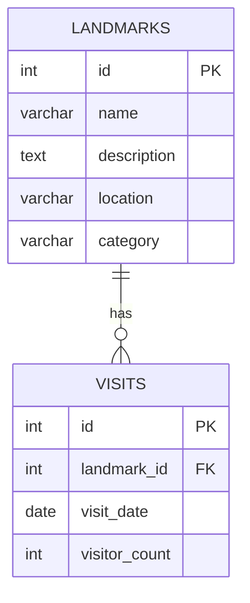

# Entity Relationship Diagram (ERD)

```mermaid
erDiagram
    LANDMARKS ||--o{ VISITS : has
    LANDMARKS {
        int id PK
        varchar name
        text description
        varchar location
        varchar category
    }
    VISITS {
        int id PK
        int landmark_id FK
        date visit_date
        int visitor_count
    }
```
